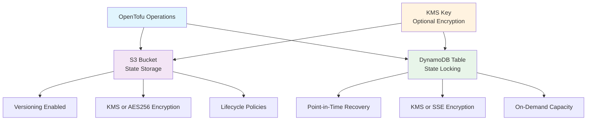

# OpenTofu AWS Backend Module

A secure OpenTofu module for provisioning an S3 bucket and DynamoDB table to serve as a remote backend for OpenTofu state management. This module follows AWS best practices for security, cost optimization, and reliability, providing robust state locking, versioning, and encryption capabilities.

## 🚀 Features

- **Secure State Storage**: S3 bucket with versioning and server-side encryption (KMS or AES256) enabled
- **State Locking**: DynamoDB table for state locking to prevent conflicts
- **Flexible Encryption**: Optional KMS key for enhanced encryption, with AES256 as the fallback
- **Security Hardened**: Blocks public access, enforces encryption at rest, and requires HTTPS
- **Cost Optimized**: Lifecycle rules to manage storage costs automatically
- **Compliance Ready**: Enforces encryption and tagging for regulatory requirements
- **Flexible Configuration**: Supports multiple environments, projects, and custom tags
- **Audit Ready**: Comprehensive versioning, access logging, and resource tagging
- **Prevent Accidental Deletion**: Lifecycle rules prevent accidental deletion of critical resources

## 🏗 Architecture



## 🔍 Deep Dive: Security & Cost Optimization

### 1. Lifecycle Configuration: Automated Cost Savings

The lifecycle configuration automates housekeeping tasks to optimize storage costs and maintain a clean bucket:

- **Permanent Deletion of Old Versions**: Non-current versions of the state file are deleted after a configurable period (default: 90 days), preventing indefinite storage costs.
- **Cleanup of Failed Uploads**: Incomplete multipart uploads are aborted after 7 days, avoiding hidden costs from orphaned data.
- **Expired Object Delete Markers**: Automatically removes expired delete markers to keep the bucket tidy.

**Important**: These rules only affect non-current versions, incomplete uploads, and delete markers, ensuring the current state file remains accessible.

### 2. Encryption: Flexible and Secure

- **KMS Encryption (Optional)**: When enabled, a dedicated KMS key encrypts both the S3 bucket and DynamoDB table, providing enhanced security and key rotation.
- **AES256 as Default**: If KMS is disabled, the S3 bucket uses AES256 server-side encryption, ensuring compliance with minimal overhead.

### 3. Bucket Policy: Enforcing Secure Connections

The bucket policy enforces secure data transit with two critical statements:

- **Enforce HTTPS**: Denies all S3 actions (`s3:*`) for non-HTTPS requests, ensuring secure connections.

## 📋 Prerequisites

- OpenTofu >= v1.10.0
- AWS Provider >= 6.13
- AWS IAM permissions to create S3 buckets, DynamoDB tables, and KMS keys (if enabled)
- Appropriate AWS credentials configured

## 🛠 Installation

Add the module to your OpenTofu configuration:

```hcl
module "opentofu_backend" {
  source = "git::https://github.com/thienhaole92/opentofu-aws-backend.git?ref=v1.0.2"

  project = "multi-account-project"
  group   = "prod" # or "nonprod" for development/staging
}
```

## ⚙️ Configuration

### 1. Default Values with KMS Encryption

```hcl
module "opentofu_backend" {
  source = "./opentofu-backend"

  project = "myproject"
  group   = "nonprod"
}
```

### 2. Custom Retention with KMS for Production

```hcl
module "opentofu_backend" {
  source = "./opentofu-backend"

  project                            = "myproject"
  region                             = "ap-southeast-1"
  group                              = "prod"
  noncurrent_version_expiration_days = 180
  enable_kms_key                     = true
  kms_deletion_window                = 15
}
```

### 3. Disable KMS (Use AES256) and Lifecycle Policies

```hcl
module "opentofu_backend" {
  source = "./opentofu-backend"

  project                   = "myproject"
  region                    = "ap-southeast-1"
  group                     = "dev"
  enable_lifecycle_policy   = false
  enable_kms_key            = false
}
```

### 4. Disable Point-in-Time Recovery and KMS

```hcl
module "opentofu_backend" {
  source = "./opentofu-backend"

  project              = "myproject"
  region               = "ap-southeast-1"
  group                = "dev"
  enable_dynamodb_pitr = false
  enable_kms_key       = false
}
```

### Outputs Integration

After deployment, integrate the backend with your OpenTofu configuration:

```hcl
terraform {
  backend "s3" {
    bucket         = module.opentofu_backend.s3_bucket_name
    key            = "terraform/prod/opentofu.tfstate"
    region         = module.opentofu_backend.region
    dynamodb_table = module.opentofu_backend.dynamodb_table_name
    encrypt        = true
  }
}
```

## 📊 Inputs

| Name                                 | Type        | Description                                                              | Default            | Required |
| :----------------------------------- | :---------- | :----------------------------------------------------------------------- | :----------------- | :------- |
| `project`                            | string      | Project name (3-32 characters, lowercase letters, numbers, hyphens)      | n/a                | yes      |
| `group`                              | string      | Environment group: 'nonprod' or 'prod'                                   | n/a                | yes      |
| `region`                             | string      | AWS region (e.g., 'us-east-1')                                           | `"ap-southeast-1"` | no       |
| `tags`                               | map(string) | Additional tags (keys: 1-128 chars, letters/numbers/hyphens/underscores) | `{}`               | no       |
| `noncurrent_version_expiration_days` | number      | Days to retain non-current versions (30-365)                             | `90`               | no       |
| `enable_lifecycle_policy`            | bool        | Enable S3 bucket lifecycle policies                                      | `true`             | no       |
| `enable_dynamodb_pitr`               | bool        | Enable Point-in-Time Recovery for DynamoDB                               | `true`             | no       |
| `enable_kms_key`                     | bool        | Enable KMS key for S3 and DynamoDB encryption                            | `true`             | no       |
| `kms_deletion_window`                | number      | Days before deleted KMS key is permanently removed (7-30)                | `30`               | no       |

## 📤 Outputs

| Name                  | Description                                    |
| :-------------------- | :--------------------------------------------- |
| `s3_bucket_name`      | Name of the S3 bucket for OpenTofu state       |
| `s3_bucket_arn`       | ARN of the S3 bucket for OpenTofu state        |
| `dynamodb_table_name` | Name of the DynamoDB table for state locking   |
| `dynamodb_table_arn`  | ARN of the DynamoDB table for state locking    |
| `kms_key_arn`         | ARN of the KMS key (null if KMS is disabled)   |
| `kms_key_alias`       | Alias of the KMS key (null if KMS is disabled) |

## 🔒 Security Considerations

- **Public Access Blocked**: All public access to the S3 bucket is blocked by default.
- **Encryption at Rest**: Mandatory encryption (KMS or AES256 for S3, KMS or SSE for DynamoDB) enforced via bucket policies.
- **Resource Protection**: Lifecycle rules prevent accidental deletion of S3 bucket and DynamoDB table.
- **Tagging**: All resources are tagged for cost allocation, including `Project`, `Environment`, `ManagedBy`, and `CreatedAt`.
- **DynamoDB PITR**: Enabled by default for backup protection (configurable).

## 💰 Cost Estimation

The configuration is optimized for cost efficiency:

- **DynamoDB**: Uses pay-per-request pricing, avoiding provisioned capacity costs.
- **S3 Storage**: Lifecycle rules clean up old versions and incomplete uploads to minimize storage costs.
- **KMS**: Optional KMS key usage allows cost savings with AES256 as the default encryption method.
- **Tagging**: Comprehensive tagging supports cost allocation and tracking.

## 🔍 Troubleshooting

### Common Issues

1. **Access Denied Errors**: Ensure IAM permissions include `s3:*`, `dynamodb:*`, and `kms:*` (if KMS is enabled).
2. **Bucket Already Exists**: Use a unique `project` name and verify region-specific naming.
3. **KMS Errors**: If KMS is enabled, ensure the IAM role has permissions to use the KMS key.

### Debugging

Enable debug logging for detailed troubleshooting:

```bash
export TF_LOG=DEBUG
tofu init
tofu apply
```

## 📄 License

This project is licensed under the MIT License
