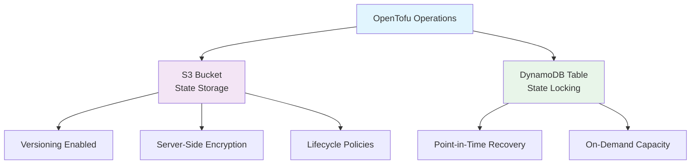

# OpenTofu AWS Backend Module

A secure OpenTofu module for provisioning an S3 bucket and DynamoDB table to serve as a remote backend for OpenTofu state management. This module follows AWS best practices for security, cost optimization, and reliability while providing robust state locking and versioning capabilities.

## 🚀 Features

- **Secure State Storage**: S3 bucket with versioning and server-side encryption (SSE-S3) enabled
- **State Locking**: DynamoDB table for state locking to prevent conflicts
- **Security Hardened**: Block public access and enforce encryption at rest
- **Cost Optimized**: Lifecycle rules to automatically manage storage costs
- **Compliance Ready**: Explicit encryption enforcement for regulatory requirements
- **Flexible Configuration**: Support for multiple environments and projects
- **Audit Ready**: Comprehensive versioning and access logging capabilities

## 🏗 Architecture



## 🔍 Deep Dive: Security & Cost Optimization

### 1. Lifecycle Configuration: Smart Cost Management

The lifecycle configuration automatically manages previous versions of state files to optimize storage costs:

| Action                        | Trigger       | Result                                                   |
| ----------------------------- | ------------- | -------------------------------------------------------- |
| **Transition to STANDARD_IA** | After 30 days | Reduces storage costs for infrequently accessed versions |
| **Transition to GLACIER**     | After 60 days | Archives versions to lowest cost storage tier            |
| **Permanent Deletion**        | After 90 days | Cleans up old versions to minimize storage usage         |

**Important**: This only affects previous versions, not the current state file, which remains immediately accessible in the STANDARD storage class.

### 2. Bucket Policy: Mandatory Security Enforcement

The bucket policy creates an explicit security guardrail using a `"Deny"` effect with two critical statements:

1. **Deny unencrypted uploads**: Blocks any `s3:PutObject` request that doesn't explicitly specify AES256 encryption
2. **Deny unencrypted uploads (alternative method)**: Blocks uploads that omit the encryption header entirely

This policy ensures that **every single object** written to the bucket must be encrypted at rest, closing security loopholes that could allow misconfigured tools or malicious actors to bypass encryption requirements.

## 📋 Prerequisites

- OpenTofu >= v1.10.5
- AWS Provider >= 6.13.0
- AWS IAM permissions to create S3 buckets and DynamoDB tables
- Appropriate AWS credentials configured

## 🛠 Installation

Add the module to your OpenTofu configuration:

```hcl
module "opentofu_backend" {
  source = "git::https://github.com/thienhaole92/opentofu-aws-backend.git?ref=v1.0.0"

  project = "multi-account-project"
  group   = "prod" # or "nonprod" for development/staging
}
```

## ⚙️ Configuration

### 1. Default Values (Current Behavior)

```hcl
module "opentofu_backend" {
  source = "./opentofu-backend"

  project = "myproject"
  group   = "nonprod"
}
```

### 2. Custom Retention for Production

```hcl
module "opentofu_backend" {
  source = "./opentofu-backend"

  project                 = "myproject"
  region                  = "ap-southeast-1"
  group                   = "prod"
  transition_ia_days      = 60
  transition_glacier_days = 120
  expiration_days         = 365
}
```

### 3. Disable Lifecycle Policies

```hcl
module "opentofu_backend" {
  source = "./opentofu-backend"

  project                   = "myproject"
  region                    = "ap-southeast-1"
  group                     = "dev"
  enable_lifecycle_policies = false
}
```

### Outputs Integration

After deployment, integrate the backend with your OpenTofu configuration:

```hcl
terraform {
  backend "s3" {
    bucket         = module.terraform_opentofu_backendbackend.s3_bucket_name
    key            = "terraform/prod/opentofu.tfstate"
    region         = module.opentofu_backend.region
    dynamodb_table = module.opentofu_backend.dynamodb_table_name
    encrypt        = true
  }
}
```

## 📊 Inputs

| Name                        | Type        | Description                                                   | Default            | Required |
| :-------------------------- | :---------- | :------------------------------------------------------------ | :----------------- | :------- |
| `project`                   | string      | Project name used for resource naming and tagging             | `"myproject"`      | yes      |
| `group`                     | string      | Environment group: 'nonprod' (dev/uat) or 'prod' (production) | `"nonprod"`        | yes      |
| `region`                    | string      | AWS region where resources will be deployed                   | `"ap-southeast-1"` | no       |
| `tags`                      | map(string) | Additional tags to apply to all resources                     | `{}`               | no       |
| `transition_ia_days`        | number      | Days before moving non-current versions to STANDARD_IA        | `30`               | no       |
| `transition_glacier_days`   | number      | Days before moving non-current versions to GLACIER            | `60`               | no       |
| `expiration_days`           | number      | Days before expiring non-current versions                     | `90`               | no       |
| `enable_lifecycle_policies` | bool        | Whether to enable S3 bucket lifecycle policies                | `true`             | no       |

## 📤 Outputs

| Name                  | Description                                         |
| :-------------------- | :-------------------------------------------------- |
| `s3_bucket_name`      | Name of the S3 bucket for OpenTofu state            |
| `s3_bucket_arn`       | ARN of the S3 bucket for OpenTofu state             |
| `dynamodb_table_name` | Name of the DynamoDB table for state locking        |
| `dynamodb_table_arn`  | ARN of the DynamoDB table for state locking         |
| `backend_config`      | Ready-to-use OpenTofu backend configuration snippet |

## 🔒 Security Considerations

- All public access is blocked by default
- Encryption at rest is mandatory and enforced through bucket policies
- All resources are tagged for cost allocation and management
- DynamoDB table has point-in-time recovery enabled for backup protection
- IAM policies should follow the principle of least privilege

## 💰 Cost Estimation

The configuration is optimized for cost efficiency:

- **DynamoDB**: Uses pay-per-request pricing (no provisioned capacity needed)
- **S3 Storage**: Lifecycle rules automatically transition data to cheaper storage classes
- **Cleanup**: Old state versions are automatically cleaned up after configurable retention periods

## 🔍 Troubleshooting

### Common Issues

1. **Access Denied Errors**: Ensure IAM permissions include s3:_, dynamodb:_
2. **Bucket Already Exists**: Use a unique project name

### Debugging

Enable debug logging for detailed troubleshooting:

```bash
export TF_LOG=DEBUG
tofu init
tofu apply
```

## 📄 License

This project is licensed under the MIT License
